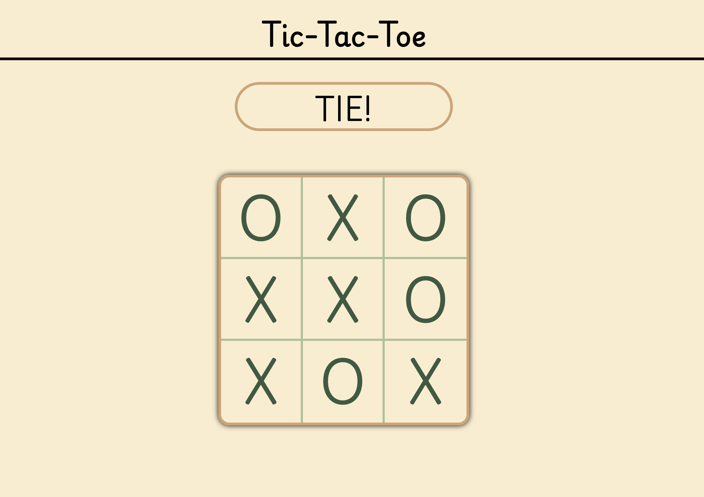

# Web Calculator App

This project is tic-tac-toe.  

This was mainly a project to get me used to basic HTML, CSS, and JS

## Notes:
  - There is no reset button, just refresh the page

### Live Site: [Here](https://ottokunkel.github.io/web-tictactoe/)

## Screenshots




## Getting Started

### Installation

1. **Clone the repository:**

    ```sh
    git clone https://github.com/yourusername/web-tictactoe.git
    ```

2. **Navigate to the project directory:**

    ```sh
    cd web-tictactoe
    ```

3. **Open `index.html` in your web browser:**

    ```sh
    open index.html
    ```


## Built With

- **HTML**: Structure of the web app.
- **CSS**: Styling for the web app.
- **JavaScript**: Logic for the game.

## Acknowledgements

- Project inspired by [The Odin Project](https://www.theodinproject.com/)

## Contact

If you have any questions, feel free to reach out:

- **Email**: ottokunkel034@gmail.com 
- **GitHub**: [yourusername](https://github.com/ottokunkel)
